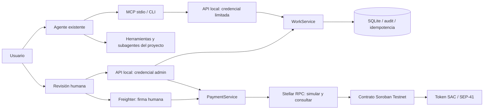

# Arquitectura Hito

## Decisión central
Hito no interpreta el repositorio. El modelo del usuario interpreta el encargo y llama a herramientas tipadas. Hito administra el compromiso y las transiciones permitidas. Los cambios de código, test runners y subagentes quedan fuera del runtime de Hito.

Diagrama de diseño, no evidencia de despliegue. La app sirve la UI desde el mismo origen para minimizar CORS/CSRF. STDIO solamente transporta tools; no implica que el servidor pueda manipular los subagentes.

## Límites de autoridad

El usuario autoriza el trabajo al agente anfitrión. Hito no tiene un mecanismo para verificar cada prompt del usuario; la skill instruye invocación explícita. La autorización económica sí se comprueba en backend/wallet/contrato. El admin local puede preparar pero no falsificar una firma de wallet; el operador de la máquina puede manipular DB/archivos, por lo que no se presenta como separación multiusuario hostil.

El modelo puede seleccionar acciones semánticas (`fund`, `submit`) pero no proporcionar addresses o montos en esos intents. Provienen del proyecto y plan sellados. El contrato conserva sus propias reglas, de modo que un cliente alternativo no puede saltar auth, destino ni pago único. La verdad técnica de la evidencia permanece fuera de cadena.

## Camino de datos

Plan JSON validado → SQLite → hash de compromiso. Delivery validada → hash de evidencia. Los documentos largos no se suben on-chain. El artefacto original tampoco se carga automáticamente a Hito; la referencia apunta a un recurso autorizado. Hashes no garantizan confidencialidad de contenidos predecibles ni que el documento sea verdadero.

## Camino de transacción

Request con idempotencyKey → fuente derivada → bloqueo de cuenta → getNetwork → simulaciones de asset/decimals/estado → build/simulate/assemble → persistir hash/unsigned XDR → revisión/firma Freighter → validar misma transacción y origen → persistir signed XDR/SUBMITTING → send → consultar getTransaction → confirmar SUCCESS/FAILED o conservar UNKNOWN.

No hay relayer de claves, auto-firma, fee bump arbitrario ni Mainnet. La UI utiliza roles de wallets distintas; el modo operador único sirve para demo, no para autenticar dos empresas distintas en producción.

## Arquitectura futura, no implementada

Despliegue remoto exige OAuth/resource indicators y controles MCP adecuados, identidad multiusuario y binding wallet por challenge, TLS, RBAC por organización, Postgres con transacciones/row locks, gestor de secretos para servicios no custodiales, colas y reconciliación durable, auditoría externa, backups y recuperación. No basta cambiar SQLite por Neon y abrir el puerto.

La integración con Linear debería referenciar issues existentes, no copiar todo el backlog. x402 requeriría un servicio real, política de presupuesto compartida, allowlist y conciliación de cargos antes de reintentar. La auto-mejora de procedimientos sigue fuera de alcance salvo nueva decisión de producto.
